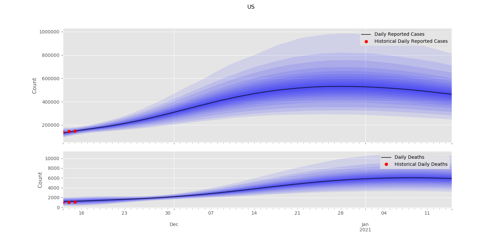
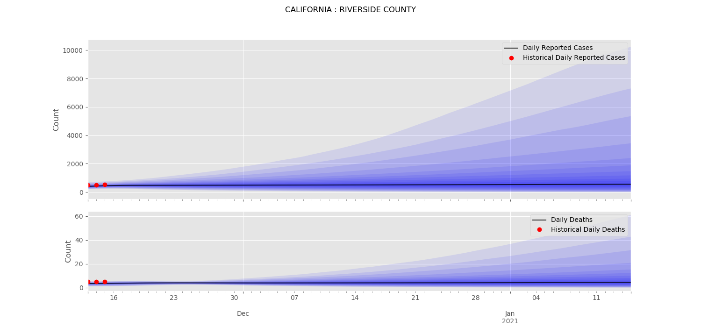
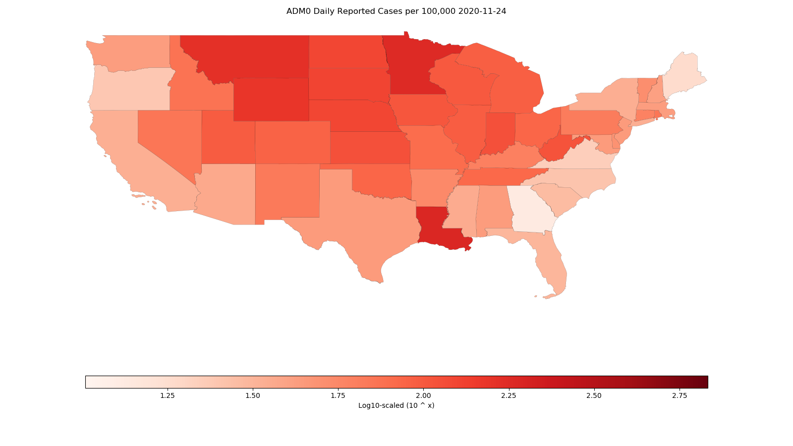
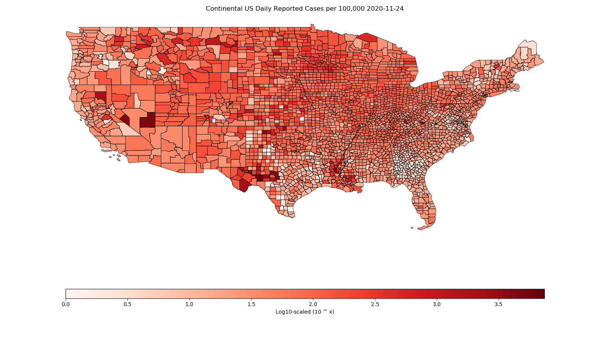

===================
Visualization Tools
===================

The Bucky model includes visualization tools for creating line plots with confidence intervals and maps. Maps and plots can be created at the national, state, or county (plots only) level. 

Plots
-----

By default (i.e. without additional arguments), ``bucky.viz.plot`` creates line plots at the national and state level for the columns ``daily_reported_cases`` and ``daily_deaths`` for the most recently postprocessed simulation data. Historical data can be added using the ``--hist`` flag. For a full list of parameters and options, see :doc:`viz module documentation <autosummary/bucky.viz>`.

To illustrate the different available geographic levels, example plots are shown below for the United States, California, and California's Riverside county. These plots include historical data and all available confidence intervals. 

.. image:: _static/DailyReportedCases_California.png
    :width: 1000

Maps
----

In addition to line plots, the Bucky model includes a module for creating map visualizations from simulated data. In order to create maps, the desired admin level must be supplied. Maps can be created daily, weekly, or monthly points throughout the simulation.

For example, to create state-level plots:

.. code-block:: bash

    ./bmodel viz.map --all_adm1 --columns cumulative_reported_cases_per_100k

This will create a map like the one shown below:

.. image:: _static/adm1_CaliforniaCumulativeReportedCasesper100,0002020-12-17.png
    :width: 1000

The mapping tool uses Matplotlib colormaps, defaulting to Reds. To use a different colormap:

.. code-block:: bash

    ./bmodel viz.map --all_adm1 --columns cumulative_reported_cases_per_100k --cmap plasma

.. image:: _static/adm1_CaliforniaCumulativeReportedCasesper100,0002020-12-17_plasma.png
    :width: 1000

CONUS Maps
++++++++++

Lookup tables can be used to create maps for a subset of data, e.g. the continental US. Two lookup tables are provided: ``CONUS_state.lookup`` and ``CONUS_county.lookup``, for the state and county level respectively.

For example, to create the state-level CONUS map above, run the following command:

.. code-block:: bash

    ./bmodel viz.map --adm0 --columns daily_reported_cases_per_100k --lookup data/lookup_tables/CONUS_state.lookup

For the county-level map:

.. code-block:: bash

    ./bmodel viz.map --all_adm1 --columns daily_reported_cases_per_100k --lookup data/lookup_tables/CONUS_county.lookup 
